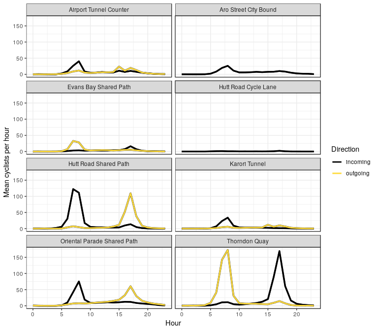
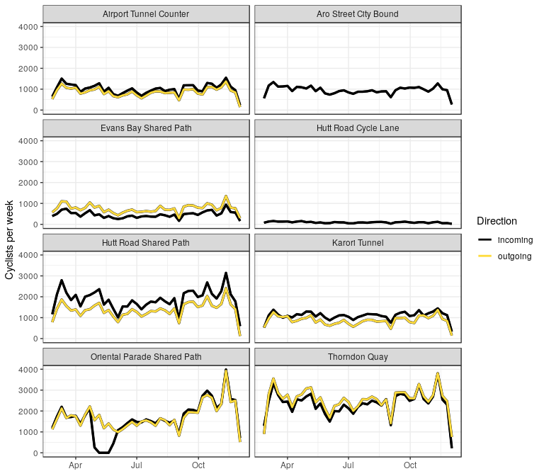

This is a simple R markdown document for processing and visualising the cycle count data handily provided
by Wellington city council using RStudio.

## The libraries we'll need

Make sure these libraries are installed in R/RStudio before you start (i.e. running these should not produce any errors). Newer versions of RStudio (v1.2 and higher) will prompt you when you load this markdown file, so just click through.


```r
library(tidyverse)
```

```
## ── Attaching packages ───────────────────────────────────────────────────────────────────────────── tidyverse 1.2.1 ──
```

```
## ✔ ggplot2 3.0.0     ✔ purrr   0.2.5
## ✔ tibble  1.4.2     ✔ dplyr   0.7.6
## ✔ tidyr   0.8.1     ✔ stringr 1.3.1
## ✔ readr   1.1.1     ✔ forcats 0.3.0
```

```
## ── Conflicts ──────────────────────────────────────────────────────────────────────────────── tidyverse_conflicts() ──
## ✖ dplyr::filter() masks stats::filter()
## ✖ dplyr::lag()    masks stats::lag()
```

```r
library(lubridate)
```

```
## 
## Attaching package: 'lubridate'
```

```
## The following object is masked from 'package:base':
## 
##     date
```

```r
library(knitr)
```

## The cycle count data

The cycle count data for Wellington is available here under the Creative Commons Attribution 4.0 BY license

https://www.transportprojects.org.nz/cycle-count-data/

Scroll down and click the Download CSV data button. The easiest thing is to save it beside this markdown file so that the loading stage works below. You may have to change the path in the `read_csv` command as no doubt the filename will change.


```r
# read in the data you've downloaded
cycle=read_csv("ecocounter_data_20181204114814.csv")
```

```
## Parsed with column specification:
## cols(
##   `Site ID` = col_integer(),
##   `Site name` = col_character(),
##   `Date/time` = col_datetime(format = ""),
##   `Incoming count` = col_integer(),
##   `Outgoing count` = col_integer()
## )
```

```r
head(cycle)
```

```
## # A tibble: 6 x 5
##   `Site ID` `Site name` `Date/time`         `Incoming count`
##       <int> <chr>       <dttm>                         <int>
## 1 100041850 Oriental P… 2018-03-01 00:00:00                0
## 2 100041850 Oriental P… 2018-03-01 01:00:00                1
## 3 100041850 Oriental P… 2018-03-01 02:00:00                0
## 4 100041850 Oriental P… 2018-03-01 03:00:00                0
## 5 100041850 Oriental P… 2018-03-01 04:00:00                1
## 6 100041850 Oriental P… 2018-03-01 05:00:00                2
## # ... with 1 more variable: `Outgoing count` <int>
```

## Initial tidying

The first thing we notice with this data is there are separate columns for incoming and outcoming counts, but the data are otherwise in long-form: i.e. each row represents either an incoming or outgoing count, not both. So we start by cleaning this up, and also simplifying the column names a bit


```r
long <- cycle %>%
  group_by(`Site ID`, `Site name`, `Date/time`) %>%
  summarise(incoming = sum(`Incoming count`), outgoing = sum(`Outgoing count`)) %>%
  gather(Direction, Count, incoming:outgoing) %>%
  rename(ID = `Site ID`, Site = `Site name`) %>%
  ungroup()
head(long)
```

```
## # A tibble: 6 x 5
##          ID Site                        `Date/time`         Direction Count
##       <int> <chr>                       <dttm>              <chr>     <int>
## 1 100041850 Oriental Parade Shared Path 2018-03-01 00:00:00 incoming      0
## 2 100041850 Oriental Parade Shared Path 2018-03-01 01:00:00 incoming      1
## 3 100041850 Oriental Parade Shared Path 2018-03-01 02:00:00 incoming      0
## 4 100041850 Oriental Parade Shared Path 2018-03-01 03:00:00 incoming      0
## 5 100041850 Oriental Parade Shared Path 2018-03-01 04:00:00 incoming      1
## 6 100041850 Oriental Parade Shared Path 2018-03-01 05:00:00 incoming      2
```

## Available counters

A table of the available counters is below.


```r
long %>% select(ID, Site) %>% unique() %>% kable()
```

        ID  Site                         
----------  -----------------------------
 100041850  Oriental Parade Shared Path  
 100041852  Hutt Road Cycle Lane         
 100041853  Hutt Road Shared Path        
 100041854  Thorndon Quay                
 100041855  Airport Tunnel Counter       
 100041856  Aro Street City Bound        
 100041898  Karori Tunnel - Karori Bound 
 100041901  Karori Tunnel City Bound     
 100048058  Evans Bay Shared Path        

We notice that the Karori tunnel has two counter labels for each direction (the others have only one label but both directions present). We next combine these together, dropping the ID column as it's not really needed given the names are unique anyway.


```r
clean_sites <- long %>% mutate(Site = fct_collapse(Site, `Karori Tunnel` = c("Karori Tunnel - Karori Bound", "Karori Tunnel City Bound"))) %>% select(-ID)
```

## Extracting date, week, hour

Next, we extract the date, week and hour from the date/time field in order to do some simple visualisation.


```r
to_week <- function(x) {
  wday(x) = 1
  x
}

clean_date <- clean_sites %>%
  mutate(Date = date(`Date/time`),
         Hour = hour(`Date/time`),
         Week = to_week(Date),
         Day = wday(Date, label=TRUE))
```

## Final cleaning

And finally we get rid of details on sites that have no incoming our outcoming data at all


```r
clean <- clean_date %>%
  group_by(Site, Direction) %>%
  mutate(TotalCount = sum(Count, na.rm=TRUE)) %>%
  filter(TotalCount > 0) %>% select(-TotalCount) %>%
  ungroup()
```

## Hourly cycling numbers Monday-Friday

To plot the hourly times during Monday-Friday


```r
hourly <- clean %>%
  filter(!Day %in% c("Sat", "Sun")) %>%
  group_by(Site, Direction, Hour) %>%
  summarise(Count = mean(Count, na.rm=TRUE))

ggplot(hourly, aes(x=Hour, y=Count)) +
  geom_line(aes(group=Direction), size=1.2, col='black') +
  geom_line(aes(col=Direction), size=1) +
  scale_color_manual(values = c("black", "#ffdc3d")) +
  facet_wrap(~Site, ncol=2) +
  ylab("Mean cyclists per hour") +
  theme_bw()
```

<!-- -->

## Weekly counts through the year


```r
weekly <- clean %>% 
  group_by(Site, Direction, Week) %>%
  summarise(Count = sum(Count, na.rm=TRUE))

ggplot(weekly, aes(x=Week, y=Count)) +
  geom_line(aes(group=Direction), size=1.2, col='black') +
  geom_line(aes(col=Direction), size=1) +
  scale_color_manual(values = c("black", "#ffdc3d")) +
  facet_wrap(~Site, ncol=2) +
  ylab("Cyclists per week") +
  theme_bw() +
  theme(axis.title.x = element_blank())
```

<!-- -->
